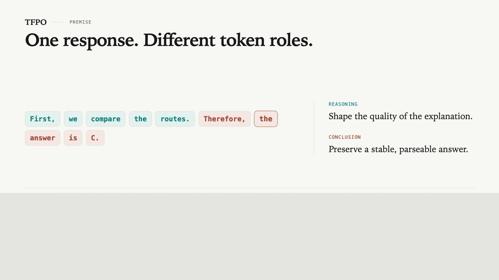

# TFPO

Project page for **TFPO: Token-Level Objective Fusion for Stable Preference Alignment**.

[Project page](https://bbbbubble.github.io/tfpo/) · [Paper](https://bbbbubble.github.io/tfpo/paper.pdf)

> **Research code will be released upon paper acceptance.** This repository
> currently contains only the project website and the source used to produce
> its explainer video. It does not contain TFPO training or evaluation code.

## Video overview

[](https://bbbbubble.github.io/tfpo/tfpo-explainer.mp4)

[Watch the narrated video](https://bbbbubble.github.io/tfpo/tfpo-explainer.mp4) · English AI-generated narration · embedded captions

## Repository layout

```text
tfpo/
├── site/    # Project-page source and public paper/video files
├── video/   # Remotion composition, narration clips, and caption timing
└── tools/   # Reproducible video-generation utility
```

Generated build directories and dependency folders are excluded from version
control. Paper figures are stored once under `site/public/assets`; the video
project references the same assets rather than keeping duplicate copies.

## Website development

```bash
cd site
npm install
npm run dev
```

The static GitHub Pages build is produced with `npm run build:pages` from the
same directory.

## Video production

```bash
python3 tools/make_explainer.py
cd video
npm install
npx remotion render TFPOExplainer ../site/public/tfpo-explainer.mp4
```

The current narration uses `en-US-AvaMultilingualNeural`. The voice is
AI-generated. The final video is rendered in 1920×1080 H.264 with a matching
WebVTT accessibility track.

## Paper provenance

`site/public/paper.pdf` is an exact copy of the author-affiliation PDF. Its
SHA-256 is:

```text
0e597b867e6e3c064dc108195f70aeb1657c1025cd63834b9693947f7e0baf3b
```

The website does not state a conference venue and does not publish the
supplementary package.
